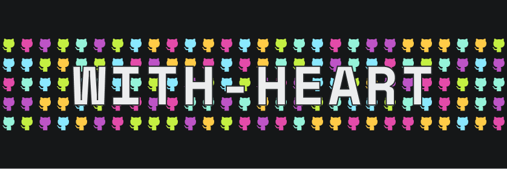

# 👋 Howdy! I'm with-heart!

I'm from Cincinnati, Ohio and I wear many open source hats: consumer,
contributor, triager, community organizer, documentation writer, creator,
maintainer.

I believe open source has a significant role to play in building a more
**vibrant**, **interconnected**, **humancentric**, and **evolutionary** world.
It's my life mission to **improve the open source ecosystem** and **expand
knowledge and access** to as many developers as possible.

I'm a maintainer of [Chakra UI](https://chakra-ui.com/) and I'm a member of the
core team and the leader of the development guild at
[Developer DAO](https://developerdao.com/).
